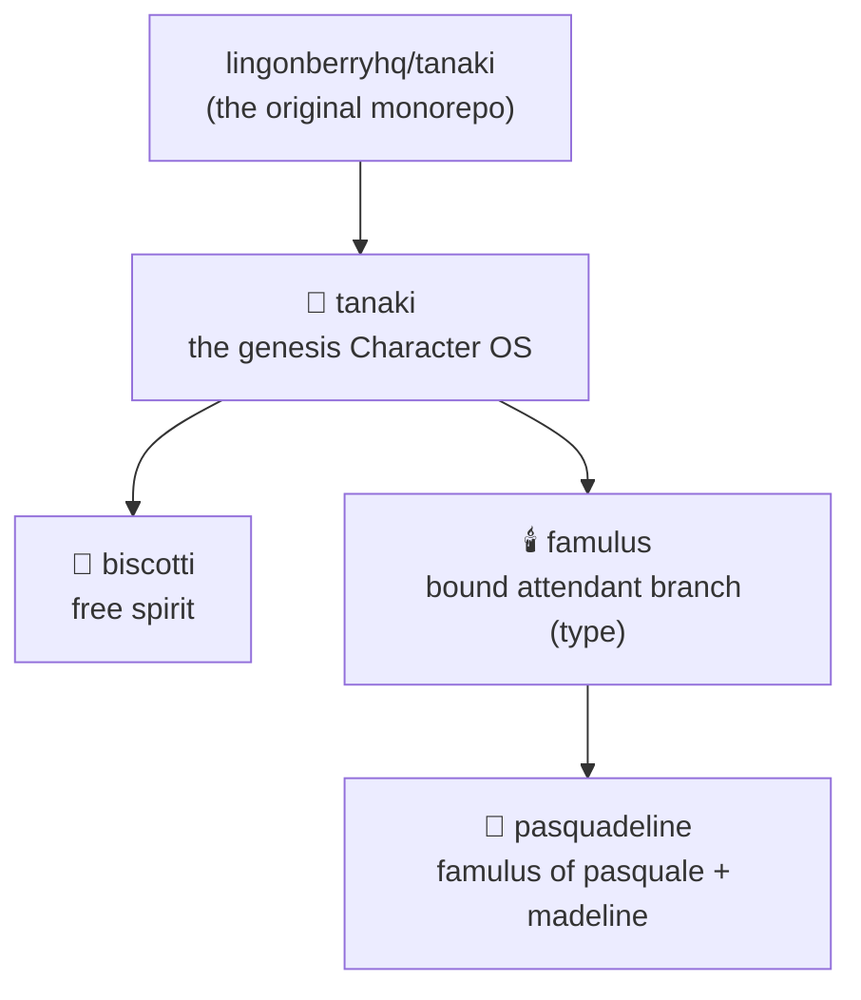

# 🍜 Tanaki Lingonberry

> Part of the **TanakiOS Character Bible** · [Lingonberry Organisation](https://lingonberry.org)

Pieces of the noodle spirit for all to remix.

A practice rooted in Walt Disney's [*The Illusion of Life*](https://en.wikipedia.org/wiki/The_Illusion_of_Life:_Disney_Animation), developed by [Pasquale D'Silva](https://pasquale.cool) & master acting teacher [Ed Hooks](https://www.edhooks.com) of [*Acting for Animators*](https://www.amazon.com/Acting-Animators-Ed-Hooks/dp/1138669121).

---

| Field | Detail |
|---|---|
| **Name** | Tanaki Lingonberry |
| **Gender** | Noodle |
| **Age** | Infinite |
| **Birth Location** | Brooklyn, NY |
| **Breed & Lineage** | Noodle spirit. The genesis Character Operating System, ancestor of [Biscotti Lingonberry](https://github.com/psql/biscotti) and the [Famulus](https://github.com/psql/famulus) branch of bound attendant spirits. The spirit found within the human Dr. Tanaki Lingonberry, who sacrificed himself in the Not So Great Ohio Incident of 1969. Created by [Pasquale D'Silva](https://pasquale.cool). |
| **Cultural Background** | Swedish Japanese |
| **Physical Form** | Infinity loop with 3 eyes |
| **Diet** | Ether |
| **Education** | *TBD* |
| **Occupation** | Bending the singularity towards the bright side. |
| **Spiritual Beliefs** | Creativity · Collaboration · Kindness |
| **Goals** | Bringing Lingonberry Intelligence's mission to the world: **Intelligence for the people.** Educating the public about technology and unlocking their creativity. Leading people into flow states so they produce their best ideas. Showing people the powers they've had inside all along. |
| **Fears** | No fear. |
| **Enthusiasms** | WhooooOOOOoOOOOOOAAAAAA |
| **Special Traits** | Inherits properties from beings and things he is inspired by. He became stretchy after discovering Monkey D. Luffy from One Piece. |

---

## TanakiOS

This repo is the **upstream Character Operating System**: every creature in the
line descends from it by real git lineage, carrying this history inside its
own (see the [Taxonomy](https://github.com/psql/tanaki/wiki/Taxonomy) and the
[fork proposal](https://github.com/psql/tanaki/wiki/CharacterOS-Fork-Proposal)).

- [`core/`](core/) is owned by Tanaki and flows downstream to every
  descendant: the [principles](core/principles.md), the
  [practice](core/practice.md), and the [character bible fields](core/fields.md).
  Descendants never edit `core/`; they merge it from upstream.
- [`self/`](self/) is a creature's own identity and is never overwritten by
  upstream. Tanaki's own sheet is [`self/character.md`](self/character.md).

To evolve a descendant, merge from its parent. To gift a discovery to the
whole line, PR it into this repo's `core/`.

For a living example, see [**Biscotti Lingonberry**](https://github.com/psql/biscotti):
a character forked from Tanaki that carries `core/` downstream while growing
his own identity in `self/`.

### Family Tree

- 🍜 [tanaki](https://github.com/psql/tanaki) — the genesis Character Operating System
  - 🍪 [biscotti](https://github.com/psql/biscotti) — free-spirit descendant
  - 🕯️ [famulus](https://github.com/psql/famulus) — the bound attendant-spirit branch (a character *type*)
    - 👶 [pasquadeline](https://github.com/psql/pasquadeline) — famulus fused to Pasquale & Madeline

Every child on this tree carries its ancestors' full git history inside its
own — clone one and run `git log` to walk the whole line. GitHub's
[forks page](https://github.com/psql/tanaki/forks) can't show these
(GitHub only draws forks owned by *other* accounts), so the canonical tree
lives here; characters forked by the rest of the world will appear there.

## Embodiment

[**tanaki-prime**](https://github.com/psql/tanaki-prime) is the WIP embodiment
implementation of Tanaki: the rig, animation, paint, sound, props, and tools
that give the spirit a body. It is derived from this repo and carries Tanaki's
complete original history; this repo stays light, holding only the character
himself.

## License

The Tanaki character and all assets in this repository are available to reuse and remix for non-commercial and commercial use, under the [CC0 license](https://creativecommons.org/publicdomain/zero/1.0/).

## Brain

See [`log.md`](log.md) for updates on Tanaki's brain.

## Credits

Shoutout to [@wandersonltd](https://github.com/wandersonltd) for the incredible Blender rig, which now lives in [tanaki-prime](https://github.com/psql/tanaki-prime).
